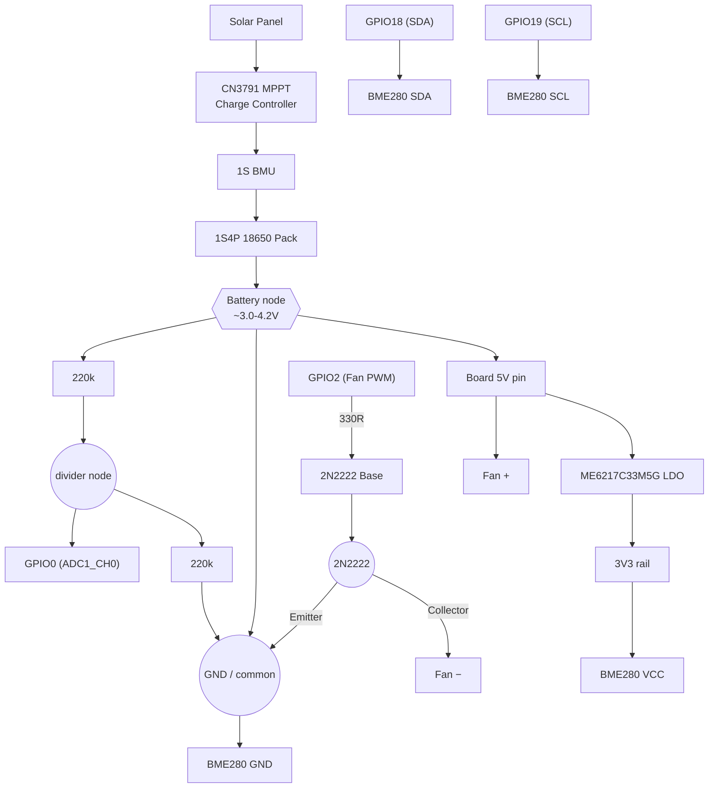

# Garden Weather Sensor

ESPHome-based temperature/humidity/pressure sensor (BME280) with active fan
cooling and battery voltage monitoring, for solar + battery powered outdoor
use. Two board variants are provided.

## Board variants

| | [garden-weather-sensor-xiao.yaml](garden-weather-sensor-xiao.yaml) | [garden-weather-sensor-waveshare.yaml](garden-weather-sensor-waveshare.yaml) |
|---|---|---|
| Board | Seeed XIAO ESP32-C6 | Waveshare ESP32-C6-Zero |
| I2C (BME280) | SDA `GPIO22`, SCL `GPIO23` | SDA `GPIO18`, SCL `GPIO19` |
| Fan PWM | `GPIO2` | `GPIO2` |
| Battery ADC | `GPIO0` | `GPIO0` |
| Battery charging | Built-in LiPo charge-management IC (charges over USB-C, auto switchover to battery) | None on-board — external CN3791 MPPT solar charge controller + 1S BMU |
| ESPHome device name | `garden-weather-sensor` | `garden-weather-sensor-ws` |

Both configs share the same sensor logic, fan thermal curve, and entity
layout — only the pins and power path differ. The device names are kept
distinct so both units can run on the network at once without a hostname or
entity collision.

### Why the pins differ

The XIAO's default I2C pins (`GPIO22`/`GPIO23`) are hardwired on the
Waveshare Zero to the onboard WS2812 RGB LED (`RGB_PWR` / `RGB_DATA`), so
the waveshare variant moves I2C to `GPIO18`/`GPIO19` instead — free on that
board, not strapping pins, not JTAG.

### Why the power path differs

The XIAO ESP32-C6 has a built-in LiPo charge-management chip: plug in
USB-C and it charges the battery and switches over automatically. The
Waveshare ESP32-C6-Zero has no charger circuitry at all — just USB-C into a
3.3V LDO (ME6217C33M5G, 2–6.5V in, ~180mV dropout).

For the waveshare variant, charging is handled externally: a **CN3791**
MPPT solar charge controller feeds a **1S BMU**-protected **1S4P 18650**
pack. USB is not used. The BMU output (the battery node itself, ~3.0–4.2V)
is wired to the board's **5V pin** (+ GND) — **not** the 3V3 pin, since a
freshly charged cell can hit 4.2V, which exceeds the ESP32-C6's absolute
max supply voltage if applied directly to 3V3. The onboard LDO regulates
the 5V-pin input down to a clean 3.3V across the whole discharge range.

Both variants sense battery voltage the same way: an external 220k/220k
divider on the battery-voltage node, into `GPIO0` (ADC1_CH0), with a
`multiply: 2.0` filter in the config to compensate.

If you see random resets around WiFi TX bursts as the battery discharges,
add a bulk capacitor (100–470µF) across 5V/GND or 3V3/GND near the board.

### Wiring diagram (Waveshare variant)



- **Power path** (left branch): solar → CN3791 MPPT → 1S BMU → 18650 pack. The
  battery node feeds the board's **5V pin** (not 3V3 — see above) and, through
  the 220k/220k divider, `GPIO0` for voltage sensing.
- **BME280**: `3V3`/`GND` for power, `GPIO18`/`GPIO19` for I2C.
- **Fan**: `GPIO2` drives the 2N2222 base through a 330Ω resistor; the
  transistor switches the fan's ground return, with the fan's positive lead
  tied to 5V.
- All `GND`/`GND common` nodes in the diagram are the same net.

## Fan cooling

Both variants drive a 2N2222-switched cooling fan (base via 330R, `GPIO2`)
off the ESP32's internal temperature sensor: off below 45°C, ramping
20%→100% duty between 45°C and 60°C, pinned at 100% at/above 60°C. A
5-minute rolling average of fan duty is exposed for tuning those
thresholds.

## Deep sleep

Both configs include a commented-out `deep_sleep` block for battery-only
operation (wake every 5 min, read, publish, sleep). It's **incompatible**
with the fan cooling logic as written — while asleep the chip isn't
tracking temperature, so the fan can't respond during a thermal event.
Don't enable deep sleep while active cooling is required.

## Secrets

Both configs expect a `secrets.yaml` (not checked in) with:

```yaml
wifi_ssid: "..."
wifi_password: "..."
fallback_password: "..."
api_encryption_key: "..."
ota_password: "..."
```
